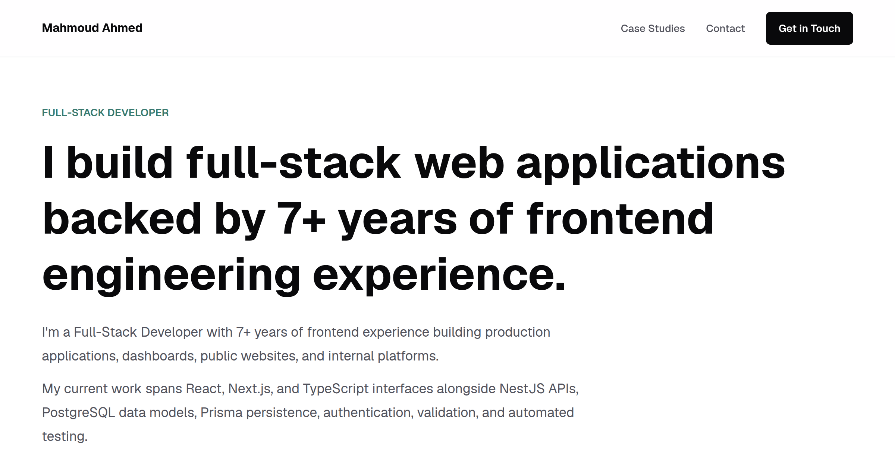

# Mahmoud Ahmed Portfolio

A public, recruiter-focused portfolio for [Mahmoud Ahmed](https://github.com/buttererror), a Full-Stack Developer with 7+ years of frontend experience and hands-on backend, database, testing, and delivery work.

The site presents professional experience through concise, public-safe summaries. It is designed to communicate engineering strengths without exposing private company code, internal systems, confidential workflows, or unsupported claims.

**Live site:** [buttererror.com](https://buttererror.com)



## Current Experience

The implemented homepage includes:

- A focused introduction and direct contact links
- Product and industry experience across renovation, healthtech, travel, e-commerce, and operations
- Full-stack capabilities spanning product interfaces, APIs, application logic, relational data, testing, and delivery
- Public-safe case-study summaries
- Full-stack engineering focus areas grounded in deep frontend experience
- Current career direction and contact call to action
- Responsive navigation, semantic structure, keyboard support, and visible focus states

Only the homepage route is currently implemented. Case-study, Projects, and Contact routes are planned as later MVP slices.

## Tech Stack

- [Next.js](https://nextjs.org/) App Router
- [React](https://react.dev/)
- [TypeScript](https://www.typescriptlang.org/)
- [Tailwind CSS](https://tailwindcss.com/)
- [ESLint](https://eslint.org/)
- [pnpm](https://pnpm.io/)

The project intentionally uses static TypeScript content and built-in framework capabilities. It does not require a CMS, database, authentication system, backend, or animation library.

## Getting Started

### Prerequisites

- Node.js 20.9.0 or newer
- pnpm 11

### Installation

```bash
pnpm install
```

### Development

```bash
pnpm dev
```

Open [http://localhost:3000](http://localhost:3000) in a browser.

## Available Commands

```bash
pnpm dev      # Start the local development server
pnpm lint     # Run ESLint
pnpm build    # Create a production build
pnpm start    # Serve the production build
```

## Project Structure

```txt
src/
  app/          # App Router layout, metadata, global styles, and routes
  components/   # Cards, layout, sections, and shared UI
  data/         # Typed, public-safe portfolio content
docs/           # Product direction, decisions, and development guidance
public/         # Static public assets
```

The homepage remains a readable composition map in `src/app/page.tsx`. Reusable presentation belongs in `src/components/`, while approved static content belongs in `src/data/`.

## Content And Privacy

Privacy is an explicit project requirement. Public content must:

- Use approved facts and links
- Generalize private projects, clients, architecture, and workflows
- Avoid private screenshots, credentials, internal domains, and company-specific implementation details
- Avoid invented metrics, evidence, links, or personal information
- Keep the distinction between 7+ years of frontend experience and recent hands-on full-stack work explicit

Every content change receives a privacy review before it is considered complete.

## Quality Checks

For meaningful code changes, run:

```bash
pnpm lint
pnpm build
```

UI work should also be reviewed at mobile, tablet, and desktop widths, with checks for semantic heading order, keyboard navigation, focus visibility, link behavior, metadata, responsive layout, and public-safe copy.

## Deployment

The production site is hosted on Vercel at [buttererror.com](https://buttererror.com). CI/CD is configured through Vercel so updates to the connected production branch are built and deployed automatically.

The apex domain redirects permanently to `https://www.buttererror.com`, which is used as the canonical production URL in the site's metadata.

## Roadmap

- Complete and refine the homepage
- Add the Renohome case-study route
- Add the Projects route
- Add the Contact route
- Finalize approved visual evidence and resume behavior
- Continue validating the Vercel production deployment as the MVP grows

## Project Documentation

- [Portfolio brief](docs/portfolio-brief.md): positioning, homepage content, and product direction
- [Open decisions](docs/open-decisions.md): unresolved or changeable product and engineering choices
- [Development guide](docs/development.md): architecture, route status, commits, and verification
- [Homepage implementation plan](docs/homepage-implementation-plan.md): completed slice sequence and review history
- [Agent guidance](AGENTS.md): repository-specific collaboration and safety rules

## Contact

- [LinkedIn](https://linkedin.com/in/buttererror)
- [GitHub](https://github.com/buttererror)

## License

No license has been granted for reuse of this repository's source code or portfolio content.
